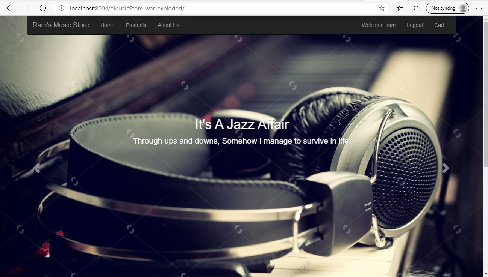

# eMusicStore
An online eCommerce music store web app using spring MVC,hibernate,jsp,bootstrap,jquery and h2 db.

<H2>Spring MVC Web App</h2>
<p>  A Customizable online music store app using Spring Model View Controller. The application has been securley made with spring security with admin and non admin roles. The admin role can enable to add products and 
  non admin can purchase products. The application has inbuilt cart system to store the products for checkout. A H2 database is used at the backend to store the data. The database tables are 
  automatically created by hibernate if not exist.
 </p>
 
 <h2> Tech stack </h2>
 <UL>
 <Li> Sping MVC </li>
 <li> Spring Security </li>
 <li> Hibernate </li>
 <li> Bootstrap </li>
 <li> Jsp and Jquery </li>
 <li> H2 DB </li>
 </UL>
 
 <h2> Installation </h2>
 
  ```
  H2 database is installed first https://www.h2database.com/html/main.html
  git clone https://github.com/RamAIbot/eMusicStore.git
  The Archive is imported to eclipse or similar IDE (https://www.eclipse.org/downloads/)
  The Project is run by using tomcat version 8.5 in port 8004 (https://archive.apache.org/dist/tomcat/tomcat-8/v8.5.0/bin/)
  ```
  
  <h2> Output Screen </h2>
  
  
  <h2> Future work </h2>
  <OL>
  <LI> Deploying the page in AWS EBS with RDS and Route 53 </LI>
  <LI> Deploying the page in Local raspberry pi zero server using tomcat </LI>
  </OL>
